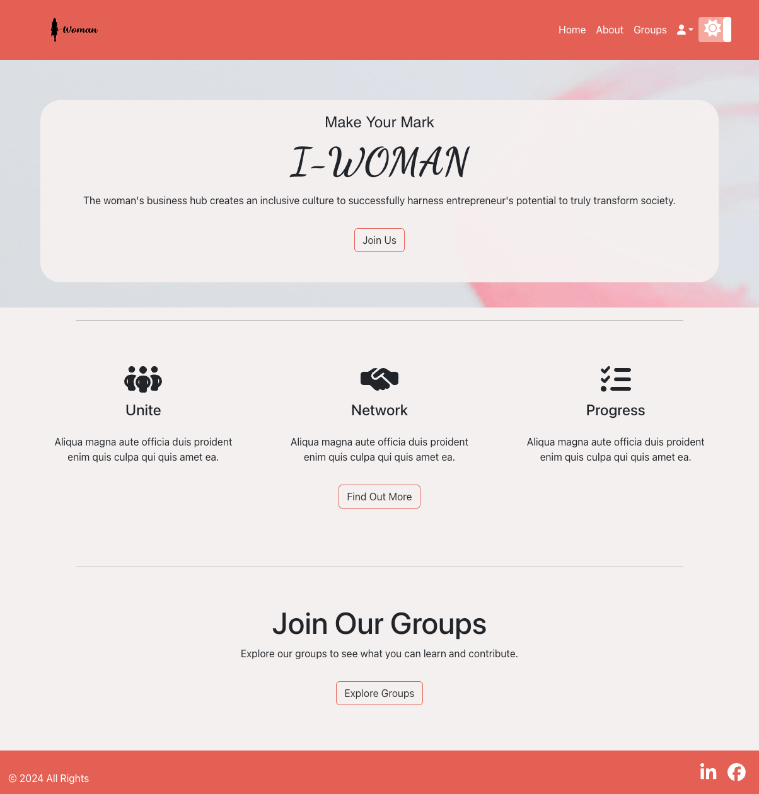

# i-woman website prototype

## Table of Contents
- [Description](#description)
- [Features](#features)
- [Installation](#installation)
- [Technologies Used](#technologies-used)
- [License](#license)
- [Acknowledgments](#acknowledgments)
- [Contact](#contact)

## Description
The i-Woman prototype site is a networking platform designed to enhance professional connections and communications among women in various industries. This project involves building a basic prototype of the website with foundational web technologies including HTML, CSS, and optional JavaScript enhancements.

## Requirements
1. HTML Structure
Document Structure: Create a basic HTML document with <html>, <head>, and <body> tags.
Header Section: Include a <header> section featuring the site's title.
Navigation Menu: Implement a navigation menu with links to the Home, Profile, Messages, and Notifications pages.
Semantic HTML: Use semantic HTML tags to improve accessibility and SEO.
2. CSS Styling
Professional Appearance: Use CSS to create a professional and modern look for the site.
Responsive Design: The layout should be responsive, adapting to various screen sizes with a mobile-first approach preferred.
Styling Consistency: Maintain consistency in fonts, colors, and spacing.
Navigation Menu: Style the navigation menu to be intuitive and easily distinguishable.
3. Content
Home Page Content: Draft concise content describing the purpose and functionalities of the site.
Placeholder Elements: Use placeholder images and text for user information and posts as needed.
4. Optional JavaScript (Bonus)
Interactive Features:
Dropdown menu for user settings or account options.
Toggle button for switching between light and dark mode themes.
Dynamic content loading for posts or notifications.

## Installation
None - this is a web application that can be accessed via the browser.

To view the code files, you can Git Clone by following the instructions below:

1. Clone the repository: git clone [https://github.com/jennysiu/i-woman]
2. Navigate to the project directory: cd i-woman
3. Open the relevant code files.

## Usage
To view the webpage, no installation is required, you can simply access the live URL here: https://i-woman-proto.netlify.app/

Screenshot of deployed app:

## Technologies Used
- HTML5
- CSS3
- Bootstrao
- React
- Netlify
- excalidraw
- Node.js
- NPM Packages: FontAwesome Icons, Vite, Vitest, React-Router-Dom

## License
Licensed under the MIT License.

## Acknowledgments
- Perenual APIs: https://perenual.com/ 
- OpenWeatherMap API: https://openweathermap.org/
- Ant Design: https://ant.design/ 
- shecodes.io
- freecodecamp.org
- geeksforgeeks.com
- stackoverflow.com

## Contact
Feel free to reach out to us if you have any questions or feedback.

Jenny Siu / [Email](jenny.siu79@gmail.com) / [LinkedIn](https://www.linkedin.com/in/jenny-siu-534576156/)